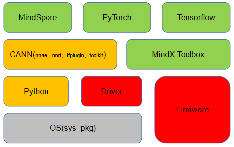

.. sectnum::

简介
=======

离线安装工具提供系统组件、python第三方依赖自动下载以及一键式安装的功能，并支持驱动、固件以及CANN软件包的安装。

快速指南
===========

本工具主要支持开局场景（环境仅安装了OS），其他场景如果遇到问题，请参考\ `ascend-deployer用户指南 <https://www.hiascend.com/document/detail/zh/ascend-deployer>`__\。

安装内容
-------------

工具支持安装的内容参考下图，其中红色部分是工具必须安装的，橙色部分和绿色部分是工具可选安装的，如果要运行框架橙色部分也是必须安装的。

安装场景
-------------

=============== ========================================================= =====================================
安装场景         安装的组件                                                 说明
=============== ========================================================= =====================================
auto            all（常用示例：sys_pkg、python、npu、toolkit、mindspore）    安装所有能找到的软件包，驱动和固件必装
vmhost          sys_pkg、npu、toolbox                                      虚拟机场景
edge            sys_pkg、atlasedge、ha                                     安装MindX中间件、HA
offline_dev     sys_pkg、python、npu、toolkit                              离线开发场景
offline_run     sys_pkg、python、npu、nnrt                                 离线运行场景
mindspore       sys_pkg、python、npu、toolkit、mindspore                   mindspore场景
tensorflow_dev  sys_pkg、python、npu、toolkit、tfplugin、tensorflow        tensorflow开发场景
tensorflow_run  sys_pkg、python、npu、nnae、tfplugin、tensorflow           tensorflow运行场景
pytorch_dev     sys_pkg、python、npu、toolkit、pytorch                     pytorch开发场景
pytorch_run     sys_pkg、python、npu、nnae、pytorch                        pytorch运行场景         
=============== ========================================================= =====================================

使用样例
-------------

以下以Ubuntu_18.04_x86_64系统，服务器上插Atlas 300I Pro推理卡为例快速展示工具的使用方式。

1. 以root用户登录待安装设备。
   
2. 执行 ``pip3 install ascend-deployer==<version>`` 安装ascend-deployer工具。<version>为ascend-deployer工具的版本号，
   建议参考\ `官网 <https://pypi.org/project/ascend-deployer/#history>`__\下载最新发布版本的工具包。如果提示pip3命令不存在，请用户自行安装。

3. 执行下载命令。
   
   ::

      ascend-download --os-list=Ubuntu_18.04_x86_64 --download=CANN==6.0.RC1,MindSpore==1.9.0

   执行以上命令后，自动下载好OS所需依赖，CANN软件包和配套的驱动和固件包，以及x86_64架构的Tensorflow安装包和docker软件等，**并存放到$HOME/ascend-deployer/resources目录下**。

4. 创建驱动的运行用户HwHiAiUser。

   ::

      groupadd HwHiAiUser
      useradd -g HwHiAiUser -d /home/HwHiAiUser -m HwHiAiUser -s /bin/bash

   创建完用户后，执行 ``passwd HwHiAiUser`` 命令设置用户密码。

5. 安装驱动和固件时，如果不是归一包（包名以 **Ascend-hdk** 开头），需在inventory_file中提前配置cus_npu_info变量。如下所示，配置cus_npu_info='300i-pro'。
   
   ::

      [ascend]
      localhost ansible_connection='local' cus_npu_info='300i-pro'

6. 执行以下安装命令，自动安装所有能找到的软件包。
   
   ::

      ascend-deployer --install-scene=auto

7. 安装后配置。
   使用python和CANN前，需要根据实际情况配置环境变量，以下内容以配置python和nnae的环境变量为例。

   ::

      source /usr/local/ascendrc                # 配置python环境变量
      source /usr/local/Ascend/nnae/set_env.sh  # 配置nnae的环境变量

8. 详细指南请参考\ `ascend-deployer用户指南 <https://www.hiascend.com/document/detail/zh/ascend-deployer>`__\
